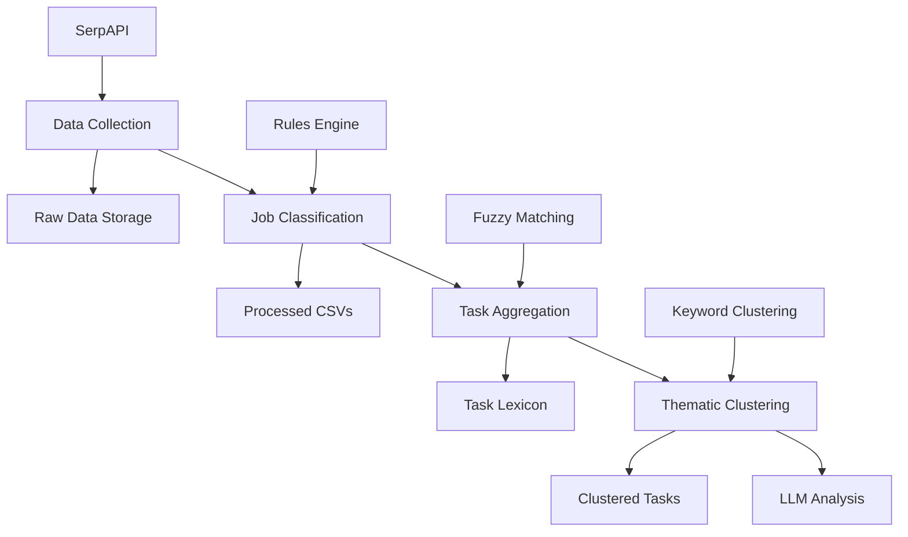

# System Architecture Overview

## High-Level Architecture

The SOC Job Task Analyzer follows a modular, pipeline-based architecture designed for research reproducibility and extensibility. The system transforms raw job posting data into structured, LLM-ready task analysis through four sequential processing stages.



## Core Components

### 1. Data Collection Module (`soc_scrapper_API.py`)

**Purpose**: Automated collection of SOC job postings from Google Jobs API

**Key Components**:
- **API Client**: SerpAPI integration with rate limiting and error handling
- **Data Extractor**: Parses job responsibilities from unstructured text
- **Deduplicator**: Prevents duplicate job collection
- **Organizer**: Quarter-based file organization for temporal analysis

**Data Flow**:
```
SerpAPI Response → JSON Parser → Responsibility Extractor → File Writer
```

**Outputs**:
- Raw JSON responses in `data/raw/serpapi/YYYY-Q#/run_*/`
- Consolidated job data with extracted responsibilities
- Run metadata in `runs_log.json`

### 2. Job Classification Module (`data_analyzer.py`)

**Purpose**: Intelligent filtering and categorization of cybersecurity roles

**Key Components**:
- **Rules Engine**: Configurable classification criteria from `configs/rules.json`
- **Text Normalizer**: Standardizes job titles and descriptions
- **SOC Filter**: Identifies Tier 1 SOC Analyst positions
- **Data Validator**: Ensures data quality and completeness

**Classification Logic**:
```python
# Pseudocode for classification process
def classify_job(job_data, rules):
    title = normalize_title(job_data['title'])
    if matches_soc_criteria(title, rules):
        return extract_responsibilities(job_data)
    return None
```

**Outputs**:
- Filtered CSV files with SOC-specific job data
- Classification metadata and filtering statistics

### 3. Task Aggregation Module (`task_aggregator.py`)

**Purpose**: Consolidation of historical job data into unified task lexicon

**Key Components**:
- **Historical Processor**: Reads all processed CSV files
- **Task Extractor**: Parses responsibilities into individual tasks
- **Fuzzy Deduplicator**: Groups similar tasks using similarity scoring
- **Frequency Analyzer**: Calculates task occurrence statistics

**Deduplication Algorithm**:
```python
# Fuzzy matching with configurable threshold
def fuzzy_deduplicate(tasks, threshold=0.88):
    consolidated = []
    for task in tasks:
        match = find_best_match(task, consolidated)
        if match.score > threshold:
            merge_tasks(match.existing, task)
        else:
            consolidated.append(task)
    return consolidated
```

**Outputs**:
- `consolidated_tasks.json`: 291 unique tasks with metadata
- `task_frequency_report.json`: Occurrence statistics
- Deduplication metrics and consolidation reports

### 4. Thematic Clustering Module (`task_thematic_clusterer.py`)

**Purpose**: Pre-LLM grouping of tasks into functional themes

**Key Components**:
- **Keyword Matcher**: Identifies thematic keywords in tasks
- **Cluster Assigner**: Maps tasks to predefined themes
- **Confidence Scorer**: Calculates assignment certainty
- **Validation Reporter**: Generates clustering statistics

**Clustering Process**:
```python
# Keyword-based clustering with confidence scoring
themes = {
    'threat_detection': ['detect', 'identify', 'monitor', 'alert'],
    'incident_response': ['respond', 'investigate', 'contain', 'mitigate'],
    # ... 8 more themes
}

def cluster_task(task_text):
    scores = {}
    for theme, keywords in themes.items():
        scores[theme] = calculate_match_score(task_text, keywords)
    best_theme = max(scores, key=scores.get)
    return best_theme, scores[best_theme]
```

**Outputs**:
- `tasks_with_candidate_themes.json`: Tasks grouped by themes
- Clustering coverage statistics (82.8% success rate)
- Confidence scores for each assignment

### 5. Pipeline Orchestrator (`job_run.py`)

**Purpose**: Unified execution and monitoring of the analysis pipeline

**Key Components**:
- **Stage Controller**: Manages execution order and dependencies
- **Error Handler**: Graceful failure recovery and logging
- **Progress Monitor**: Real-time execution tracking
- **Results Aggregator**: Consolidates outputs and metrics

**Execution Flow**:
```python
def run_pipeline(skip_raw=False, cluster_only=False):
    if not skip_raw:
        run_data_collection()
    run_job_classification()
    run_task_aggregation()
    if not cluster_only:
        run_thematic_clustering()
    generate_summary_report()
```

## Data Architecture

### Storage Organization

```
data/
├── raw/
│   └── serpapi/
│       ├── 2024-Q4/
│       │   ├── run_001/
│       │   │   ├── jobs_20241201_120000.json
│       │   │   └── metadata.json
│       │   └── runs_log.json
│       └── ...
├── processed/
│   ├── soc_jobs_flattened_*.csv
│   ├── task_lexicon/
│   │   ├── consolidated_tasks.json
│   │   ├── task_frequency_report.json
│   │   └── deduplication_metrics.json
│   └── thematic_clusters/
│       ├── tasks_with_candidate_themes.json
│       └── clustering_validation.json
└── pipeline_logs/
    ├── pipeline_summary.json
    └── execution_metrics.json
```

### Data Flow Patterns

**Raw Data Ingestion**:
- API responses stored as timestamped JSON files
- Quarter-based organization for temporal analysis
- Metadata tracking for reproducibility

**Processing Pipeline**:
- CSV intermediate format for compatibility
- JSON final outputs for structured analysis
- Progressive data enrichment through each stage

**Output Optimization**:
- LLM-ready formats with minimal preprocessing
- Structured metadata for research validation
- Compressed storage for large datasets

## Configuration Architecture

### Rules Engine (`configs/rules.json`)

**Structure**:
```json
{
  "soc_analyst_tier1": {
    "title_patterns": [
      {"contains": "soc", "case_insensitive": true},
      {"regex": "security operations", "case_insensitive": true}
    ],
    "exclude_patterns": [
      {"contains": "senior", "case_insensitive": true}
    ]
  }
}
```

**Extensibility**:
- JSON schema for validation
- Hierarchical rule application
- Runtime rule reloading

### Environment Variables

**Required Variables**:
- `SERPAPI_KEY`: API authentication
- `DATA_DIR`: Custom data directory path
- `LOG_LEVEL`: Debugging verbosity

**Optional Variables**:
- `MAX_JOBS_PER_RUN`: API call limiting
- `FUZZY_THRESHOLD`: Deduplication sensitivity
- `CLUSTER_CONFIDENCE_MIN`: Clustering quality threshold

## Error Handling and Resilience

### Exception Hierarchy

```
PipelineError
├── APIError (SerpAPI failures)
├── DataError (parsing/validation issues)
├── ConfigurationError (invalid settings)
└── ProcessingError (algorithm failures)
```

### Recovery Strategies

**API Failures**:
- Exponential backoff retry
- Partial result saving
- Graceful degradation

**Data Issues**:
- Schema validation with detailed error messages
- Missing field handling with defaults
- Data quality logging

**Processing Errors**:
- Checkpoint saving for resumability
- Alternative algorithm fallbacks
- Detailed error context logging

## Performance Characteristics

### Execution Metrics

| Stage | Execution Time | Memory Usage | I/O Operations |
|-------|----------------|--------------|----------------|
| Data Collection | 30-60s | 50MB | API calls + file writes |
| Classification | 10-20s | 100MB | CSV processing |
| Aggregation | 5-10s | 200MB | Multi-file processing |
| Clustering | 2-5s | 50MB | JSON processing |
| **Total** | **~14s** | **~200MB peak** | **Mixed I/O** |

### Scalability Considerations

**Data Volume**:
- Handles 1000+ jobs per run
- Linear scaling with job count
- Memory-efficient streaming for large datasets

**Concurrent Processing**:
- Single-threaded for API rate limiting
- Parallel processing options for batch analysis
- Resource pooling for multiple runs

**Storage Optimization**:
- Compressed JSON storage
- Incremental processing for updates
- Archive strategies for historical data

## Security Architecture

### API Security
- Environment variable key storage
- No hardcoded credentials
- Key rotation support

### Data Privacy
- No personal information collection
- Job posting data anonymization
- Compliance with data protection regulations

### Code Security
- Input validation and sanitization
- Safe file operations
- Dependency vulnerability scanning

## Extensibility Framework

### Module Interface

Each pipeline stage implements a standard interface:

```python
class PipelineStage:
    def execute(self, input_data, config):
        """Execute stage logic"""
        pass

    def validate_input(self, data):
        """Validate input data"""
        pass

    def get_metrics(self):
        """Return execution metrics"""
        pass
```

### Plugin Architecture

**Data Sources**:
- SerpAPI (current)
- LinkedIn scraper (available)
- Indeed integration (planned)

**Classification Engines**:
- Rules-based (current)
- ML-based classifier (planned)
- Hybrid approach (future)

**Clustering Algorithms**:
- Keyword matching (current)
- Semantic clustering (planned)
- Hierarchical grouping (future)

## Monitoring and Observability

### Logging Architecture

**Log Levels**:
- DEBUG: Detailed execution tracing
- INFO: Stage completion and metrics
- WARNING: Recoverable issues
- ERROR: Failures requiring attention

**Structured Logging**:
```json
{
  "timestamp": "2024-12-01T12:00:00Z",
  "level": "INFO",
  "stage": "aggregation",
  "message": "Task deduplication completed",
  "metrics": {
    "input_tasks": 1059,
    "output_tasks": 291,
    "deduplication_rate": 0.725
  }
}
```

### Metrics Collection

**Pipeline Metrics**:
- Execution time per stage
- Success/failure rates
- Data quality scores
- Resource utilization

**Business Metrics**:
- Jobs processed per run
- Unique tasks identified
- Clustering coverage percentage
- API usage statistics

## Deployment Architecture

### Development Environment
- Local virtual environment
- VS Code with Python extensions
- Git version control

### Research Environment
- Reproducible setup scripts
- Container support (Docker)
- Automated testing suite

### Production Considerations
- Batch processing capabilities
- Monitoring and alerting
- Backup and recovery procedures

## Future Architecture Evolution

### Planned Enhancements

**LLM Integration**:
- Semantic task analysis
- Automated theme discovery
- Quality validation of clustering

**Scalability Improvements**:
- Distributed processing
- Database storage backend
- Real-time data ingestion

**Advanced Analytics**:
- Temporal trend analysis
- Geographic skill mapping
- Industry benchmarking

This architecture provides a solid foundation for research while maintaining flexibility for future enhancements and extensions.

---

**Last Updated:** December 2024
**Version:** 1.0.0