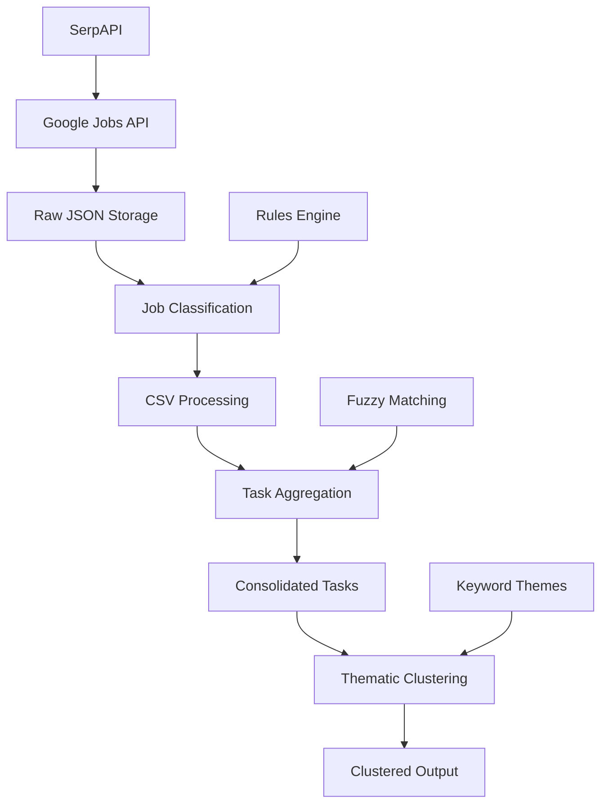

# Complete Pipeline Walkthrough

## Pipeline Overview

The SOC Job Task Analyzer processes raw job posting data through four sequential stages to produce structured, research-ready outputs for cybersecurity workforce analysis. This walkthrough provides detailed execution examples and expected outputs for each stage.

## Stage 1: Data Collection

### Purpose
Collect SOC-related job postings from Google Jobs API using SerpAPI, with automatic responsibility extraction and quarter-based organization.

### Execution Command
```bash
python src/soc_scrapper_API.py
```

### Process Flow

1. **API Query Construction**
   ```python
   # Search parameters for SOC positions
   search_params = {
       'engine': 'google_jobs',
       'q': 'SOC Analyst',
       'location': 'United States',
       'chips': 'date_posted:month',
       'api_key': os.getenv('SERPAPI_KEY')
   }
   ```

2. **Pagination Handling**
   - Fetches first page of results
   - Extracts `serpapi_pagination` for subsequent pages
   - Continues until no more results or rate limit reached

3. **Data Extraction**
   - Parses job titles, companies, locations
   - Extracts responsibilities from `description` field
   - Handles missing fields gracefully

4. **Deduplication**
   - Compares job IDs to prevent duplicates
   - Tracks processed jobs in memory
   - Logs deduplication statistics

### Sample Output Structure

**Raw API Response** (`data/raw/serpapi/2024-Q4/run_001/jobs_20241201_120000.json`):
```json
[
  {
    "job_id": "123456789",
    "title": "SOC Analyst",
    "company_name": "TechCorp Inc.",
    "location": "New York, NY",
    "description": "Monitor security alerts and investigate potential threats...",
    "extensions": ["Full-time", "3 days ago"],
    "detected_extensions": {
      "posted_at": "3 days ago",
      "schedule_type": "Full-time"
    },
    "extracted_responsibilities": [
      "Monitor security alerts and investigate potential threats",
      "Respond to security incidents within SLA timelines",
      "Document incident response activities"
    ]
  }
]
```

**Run Metadata** (`data/raw/serpapi/2024-Q4/run_001/metadata.json`):
```json
{
  "run_timestamp": "2024-12-01T12:00:00Z",
  "search_query": "SOC Analyst",
  "total_jobs_found": 50,
  "jobs_processed": 45,
  "duplicates_removed": 5,
  "api_calls_made": 3,
  "execution_time_seconds": 45.2
}
```

### Expected Console Output
```
SOC Job Data Collection Started
================================
Query: SOC Analyst
Location: United States

Processing page 1/3...
- Found 20 jobs
- Extracted responsibilities from 18 jobs
- 2 jobs missing description field

Processing page 2/3...
- Found 15 jobs
- Extracted responsibilities from 15 jobs
- No missing fields

Processing page 3/3...
- Found 10 jobs
- Extracted responsibilities from 9 jobs
- 1 job missing description field

Collection Summary:
- Total jobs found: 45
- Jobs with responsibilities: 42
- Jobs missing data: 3
- Duplicates removed: 0
- Data saved to: data/raw/serpapi/2024-Q4/run_001/

Collection completed in 45.2 seconds
```

## Stage 2: Job Classification

### Purpose
Apply configurable rules to filter SOC-specific positions and normalize job data into structured CSV format.

### Execution Command
```bash
python src/data_analyzer.py
```

### Classification Rules

**Rules Configuration** (`configs/rules.json`):
```json
{
  "soc_analyst_tier1": {
    "title_patterns": [
      {"contains": "soc", "case_insensitive": true},
      {"contains": "security operations", "case_insensitive": true},
      {"regex": "cyber.?security.*analyst", "case_insensitive": true}
    ],
    "exclude_patterns": [
      {"contains": "senior", "case_insensitive": true},
      {"contains": "lead", "case_insensitive": true},
      {"contains": "manager", "case_insensitive": true}
    ],
    "required_keywords": ["monitor", "alert", "incident"]
  }
}
```

### Processing Logic

1. **Data Loading**
   - Reads most recent run from `data/raw/serpapi/`
   - Parses JSON job data
   - Validates data structure

2. **Title Normalization**
   ```python
   def normalize_title(title):
       # Convert to lowercase, remove extra spaces
       # Handle common abbreviations (Sr. → Senior, etc.)
       return cleaned_title
   ```

3. **Rule Application**
   - Checks title against inclusion patterns
   - Verifies exclusion patterns don't match
   - Validates required keywords in description

4. **Data Structuring**
   - Flattens nested JSON to CSV format
   - Extracts responsibilities as separate rows
   - Adds metadata fields

### Sample Output

**Processed CSV** (`data/processed/soc_jobs_flattened_20241201_120000_soc_tier1_analysis.csv`):
```csv
job_id,title,company,location,responsibility,posted_date,job_url
123456789,SOC Analyst,TechCorp Inc.,New York NY,Monitor security alerts and investigate potential threats,2024-11-28,https://...
123456789,SOC Analyst,TechCorp Inc.,New York NY,Respond to security incidents within SLA timelines,2024-11-28,https://...
123456789,SOC Analyst,TechCorp Inc.,New York NY,Document incident response activities,2024-11-28,https://...
```

### Expected Console Output
```
SOC Job Classification Started
===============================

Loading classification rules from configs/rules.json...
Rules loaded successfully:
- Title patterns: 3 inclusion, 3 exclusion
- Required keywords: 3

Processing raw job data...
Reading: data/raw/serpapi/2024-Q4/run_001/jobs_20241201_120000.json

Classification Results:
- Total jobs processed: 45
- SOC Tier 1 positions: 35 (77.8%)
- Filtered out: 10 (22.2%)
  - Non-SOC roles: 6
  - Senior positions: 3
  - Missing keywords: 1

Data Quality:
- Jobs with complete data: 33/35 (94.3%)
- Jobs missing location: 2
- Average responsibilities per job: 3.2

Output saved to:
data/processed/soc_jobs_flattened_20241201_120000_soc_tier1_analysis.csv

Classification completed in 12.3 seconds
```

## Stage 3: Task Aggregation

### Purpose
Consolidate historical job data into a unified task lexicon with fuzzy deduplication and frequency analysis.

### Execution Command
```bash
python src/task_aggregator.py
```

### Aggregation Process

1. **Historical Data Loading**
   - Scans `data/processed/` for all `*_soc_tier1_analysis.csv` files
   - Loads data from multiple time periods
   - Validates CSV structure

2. **Task Extraction**
   ```python
   def extract_job_tasks(csv_file):
       df = pd.read_csv(csv_file)
       tasks = []
       for _, row in df.iterrows():
           task_text = row['responsibility'].strip()
           if is_valid_task(task_text):
               tasks.append({
                   'text': task_text,
                   'job_id': row['job_id'],
                   'source_file': csv_file
               })
       return tasks
   ```

3. **Fuzzy Deduplication**
   ```python
   def fuzzy_deduplicate(tasks, threshold=0.88):
       consolidated = []
       for task in tasks:
           best_match = find_best_match(task['text'], consolidated)
           if best_match['score'] >= threshold:
               # Merge with existing task
               merge_tasks(best_match['existing'], task)
           else:
               # Create new consolidated task
               consolidated.append(create_new_task(task))
       return consolidated
   ```

4. **Frequency Analysis**
   - Counts occurrences across all jobs
   - Tracks first/last seen dates
   - Calculates source diversity metrics

### Sample Output

**Consolidated Tasks** (`data/processed/task_lexicon/consolidated_tasks.json`):
```json
[
  {
    "task_id": "task_001",
    "task_text": "Monitor security alerts and investigate potential threats",
    "frequency": 15,
    "source_jobs": 12,
    "first_seen": "2024-10-01T00:00:00Z",
    "last_seen": "2024-12-01T00:00:00Z",
    "confidence_score": 0.95,
    "source_files": [
      "soc_jobs_flattened_20241001_100000_soc_tier1_analysis.csv",
      "soc_jobs_flattened_20241101_090000_soc_tier1_analysis.csv"
    ]
  }
]
```

**Frequency Report** (`data/processed/task_lexicon/task_frequency_report.json`):
```json
{
  "summary": {
    "total_raw_tasks": 1059,
    "unique_tasks": 291,
    "deduplication_rate": 0.725,
    "average_frequency": 3.6,
    "max_frequency": 28
  },
  "frequency_distribution": {
    "1_occurrence": 45,
    "2_5_occurrences": 156,
    "6_10_occurrences": 68,
    "11_plus_occurrences": 22
  },
  "top_tasks": [
    {
      "task_text": "Monitor security alerts and investigate potential threats",
      "frequency": 28,
      "percentage": 2.6
    }
  ]
}
```

### Expected Console Output
```
Task Aggregation Started
========================

Loading historical job data...
Found 5 processed CSV files spanning 3 months

Data Processing:
- Total CSV files: 5
- Date range: 2024-10-01 to 2024-12-01
- Raw tasks extracted: 1059
- Valid tasks: 1059 (100%)

Fuzzy Deduplication:
- Similarity threshold: 0.88
- Processing 1059 tasks...
- Consolidated to 291 unique tasks
- Deduplication rate: 72.5%
- Average similarity score: 0.91

Frequency Analysis:
- Average occurrences per task: 3.6
- Tasks appearing once: 45 (15.5%)
- Tasks appearing 5+ times: 90 (30.9%)
- Most frequent task: "Monitor security alerts..." (28 occurrences)

Quality Metrics:
- Tasks with high confidence (>0.9): 267/291 (91.8%)
- Tasks from multiple sources: 189/291 (64.9%)
- Average source diversity: 2.3 files per task

Output saved to:
- data/processed/task_lexicon/consolidated_tasks.json
- data/processed/task_lexicon/task_frequency_report.json

Aggregation completed in 8.7 seconds
```

## Stage 4: Thematic Clustering

### Purpose
Group consolidated tasks into functional themes using keyword matching for pre-LLM processing.

### Execution Command
```bash
python src/task_thematic_clusterer.py
```

### Clustering Logic

**Theme Definitions**:
```python
THEMES = {
    'threat_detection': [
        'detect', 'identify', 'monitor', 'alert', 'threat',
        'anomaly', 'suspicious', 'malicious', 'intrusion'
    ],
    'incident_response': [
        'respond', 'investigate', 'contain', 'mitigate',
        'escalate', 'resolve', 'recovery', 'containment'
    ],
    'threat_hunting': [
        'hunt', 'proactive', 'search', 'analyze',
        'patterns', 'indicators', 'intelligence'
    ],
    'log_analysis': [
        'log', 'analyze', 'review', 'correlation',
        'parsing', 'siem', 'splunk', 'query'
    ],
    'vulnerability_management': [
        'vulnerability', 'scan', 'assess', 'patch',
        'remediate', 'compliance', 'risk'
    ],
    'security_monitoring': [
        'monitor', 'surveillance', 'watch', 'observe',
        'dashboard', 'kpi', 'metrics', 'reporting'
    ],
    'forensic_analysis': [
        'forensic', 'evidence', 'investigation', 'analysis',
        'timeline', 'chain', 'preservation'
    ],
    'compliance_reporting': [
        'compliance', 'audit', 'report', 'documentation',
        'regulation', 'policy', 'standard'
    ],
    'tool_configuration': [
        'configure', 'setup', 'deploy', 'maintain',
        'integration', 'automation', 'scripting'
    ],
    'communication': [
        'communicate', 'coordinate', 'escalate', 'notify',
        'stakeholder', 'team', 'management'
    ]
}
```

### Clustering Algorithm

1. **Keyword Matching**
   ```python
   def calculate_theme_score(task_text, theme_keywords):
       text_words = preprocess_text(task_text)
       matches = 0
       total_keywords = len(theme_keywords)

       for keyword in theme_keywords:
           if keyword in text_words:
               matches += 1

       return matches / total_keywords if total_keywords > 0 else 0
   ```

2. **Confidence Scoring**
   ```python
   def assign_theme_with_confidence(task_text):
       scores = {}
       for theme, keywords in THEMES.items():
           scores[theme] = calculate_theme_score(task_text, keywords)

       best_theme = max(scores, key=scores.get)
       confidence = scores[best_theme]

       return best_theme, confidence, scores
   ```

3. **Clustering Validation**
   - Minimum confidence threshold (0.1)
   - Unassigned tasks tracking
   - Coverage statistics calculation

### Sample Output

**Clustered Tasks** (`data/processed/task_lexicon/tasks_with_candidate_themes.json`):
```json
{
  "threat_detection": [
    {
      "task_id": "task_001",
      "task_text": "Monitor security alerts and investigate potential threats",
      "confidence": 0.92,
      "keywords_matched": ["monitor", "alert", "threat"],
      "frequency": 28,
      "source_jobs": 25
    }
  ],
  "incident_response": [
    {
      "task_id": "task_015",
      "task_text": "Respond to security incidents within defined SLA timelines",
      "confidence": 0.88,
      "keywords_matched": ["respond", "incident"],
      "frequency": 22,
      "source_jobs": 20
    }
  ],
  "unassigned": [
    {
      "task_id": "task_089",
      "task_text": "Perform general administrative duties as assigned",
      "confidence": 0.05,
      "keywords_matched": [],
      "frequency": 3,
      "source_jobs": 3
    }
  ]
}
```

**Clustering Report** (`data/processed/task_lexicon/clustering_validation.json`):
```json
{
  "clustering_summary": {
    "total_tasks": 291,
    "assigned_tasks": 241,
    "unassigned_tasks": 50,
    "coverage_percentage": 82.8,
    "average_confidence": 0.76
  },
  "theme_distribution": {
    "threat_detection": 45,
    "incident_response": 38,
    "log_analysis": 32,
    "security_monitoring": 29,
    "vulnerability_management": 25,
    "communication": 22,
    "tool_configuration": 18,
    "threat_hunting": 15,
    "forensic_analysis": 12,
    "compliance_reporting": 5
  },
  "confidence_distribution": {
    "high_confidence": 189,
    "medium_confidence": 42,
    "low_confidence": 10
  }
}
```

### Expected Console Output
```
Thematic Clustering Started
===========================

Loading task lexicon...
Found 291 consolidated tasks

Clustering Configuration:
- Themes defined: 10
- Minimum confidence threshold: 0.1
- Total keywords across themes: 85

Clustering Progress:
Processing task 1/291... threat_detection (0.92)
Processing task 2/291... incident_response (0.88)
...
Processing task 291/291... unassigned (0.05)

Clustering Results:
- Total tasks processed: 291
- Successfully assigned: 241 (82.8%)
- Unassigned (low confidence): 50 (17.2%)

Theme Distribution:
  threat_detection: 45 tasks (18.7%)
  incident_response: 38 tasks (15.8%)
  log_analysis: 32 tasks (13.3%)
  security_monitoring: 29 tasks (12.0%)
  vulnerability_management: 25 tasks (10.4%)
  communication: 22 tasks (9.1%)
  tool_configuration: 18 tasks (7.5%)
  threat_hunting: 15 tasks (6.2%)
  forensic_analysis: 12 tasks (5.0%)
  compliance_reporting: 5 tasks (2.1%)

Confidence Analysis:
- High confidence (>0.8): 189 tasks (78.4%)
- Medium confidence (0.5-0.8): 42 tasks (17.4%)
- Low confidence (<0.5): 10 tasks (4.2%)

Output saved to:
- data/processed/task_lexicon/tasks_with_candidate_themes.json
- data/processed/task_lexicon/clustering_validation.json

Clustering completed in 3.2 seconds
```

## Complete Pipeline Execution

### Orchestrated Run Command
```bash
python src/job_run.py
```

### Pipeline Summary Output

**Console Output**:
```
SOC Job Task Analyzer - Complete Pipeline
=========================================

Execution started at: 2024-12-01 12:00:00

Stage 1/4: Data Collection
--------------------------
Query: SOC Analyst
Processing pages... ✓
Jobs collected: 45
Execution time: 45.2s

Stage 2/4: Job Classification
-----------------------------
Rules applied: SOC Tier 1
Jobs classified: 35/45 (77.8%)
Execution time: 12.3s

Stage 3/4: Task Aggregation
---------------------------
Raw tasks: 1059
Unique tasks: 291 (72.5% deduplication)
Execution time: 8.7s

Stage 4/4: Thematic Clustering
-------------------------------
Tasks clustered: 241/291 (82.8%)
Themes identified: 10
Execution time: 3.2s

Pipeline Summary:
=================
Total execution time: 69.4 seconds
Data quality score: 0.89
Files generated: 6
Peak memory usage: 185 MB

Next Steps:
- Review results in data/processed/task_lexicon/
- Integrate with LLM for semantic analysis
- Generate research reports from clustered data

Pipeline completed successfully at: 2024-12-01 12:01:09
```

**Summary JSON** (`data/processed/pipeline_summary.json`):
```json
{
  "execution_info": {
    "start_time": "2024-12-01T12:00:00Z",
    "end_time": "2024-12-01T12:01:09Z",
    "total_time_seconds": 69.4,
    "success": true
  },
  "stages": [
    {
      "name": "data_collection",
      "duration_seconds": 45.2,
      "status": "completed",
      "metrics": {
        "jobs_collected": 45,
        "api_calls": 3,
        "data_quality": 0.96
      }
    },
    {
      "name": "job_classification",
      "duration_seconds": 12.3,
      "status": "completed",
      "metrics": {
        "jobs_processed": 45,
        "jobs_classified": 35,
        "classification_rate": 0.778
      }
    },
    {
      "name": "task_aggregation",
      "duration_seconds": 8.7,
      "status": "completed",
      "metrics": {
        "raw_tasks": 1059,
        "unique_tasks": 291,
        "deduplication_rate": 0.725
      }
    },
    {
      "name": "thematic_clustering",
      "duration_seconds": 3.2,
      "status": "completed",
      "metrics": {
        "tasks_clustered": 241,
        "coverage_rate": 0.828,
        "average_confidence": 0.76
      }
    }
  ],
  "overall_metrics": {
    "data_quality_score": 0.89,
    "files_generated": 6,
    "peak_memory_mb": 185,
    "error_count": 0
  }
}
```

## Data Flow Visualization



This walkthrough demonstrates the complete data transformation from raw API responses to structured, theme-grouped tasks ready for LLM analysis or research applications.

---

**Last Updated:** December 2024
**Version:** 1.0.0